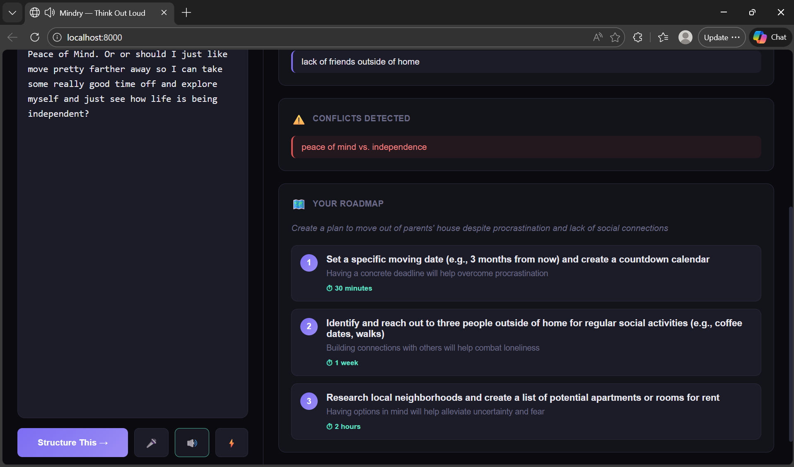
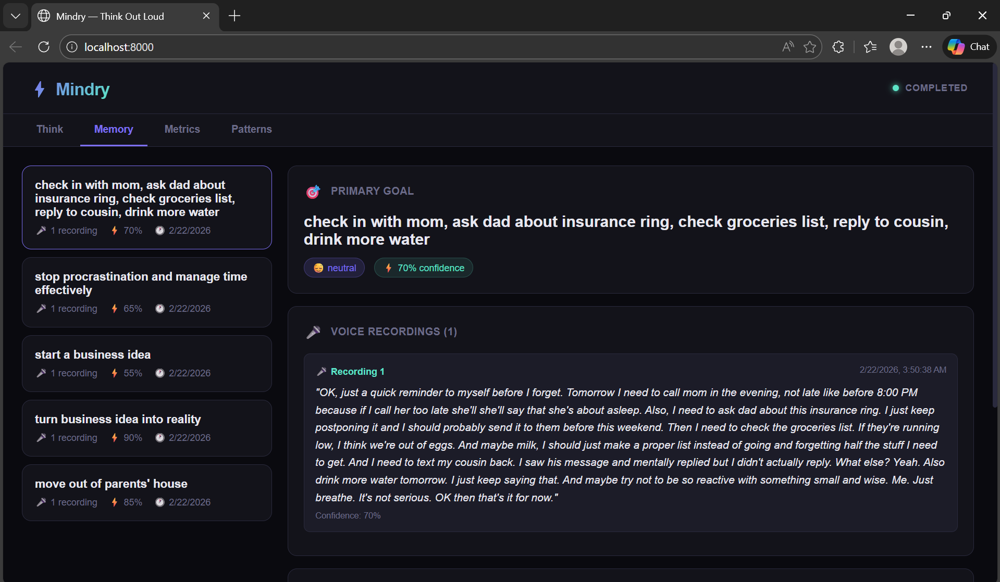
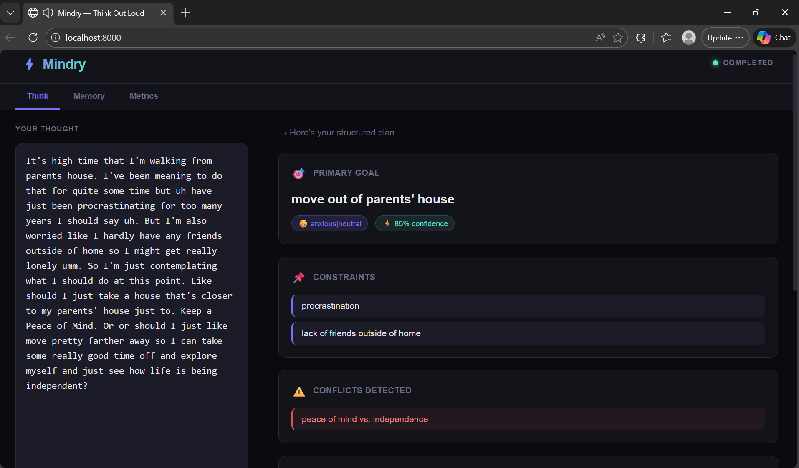
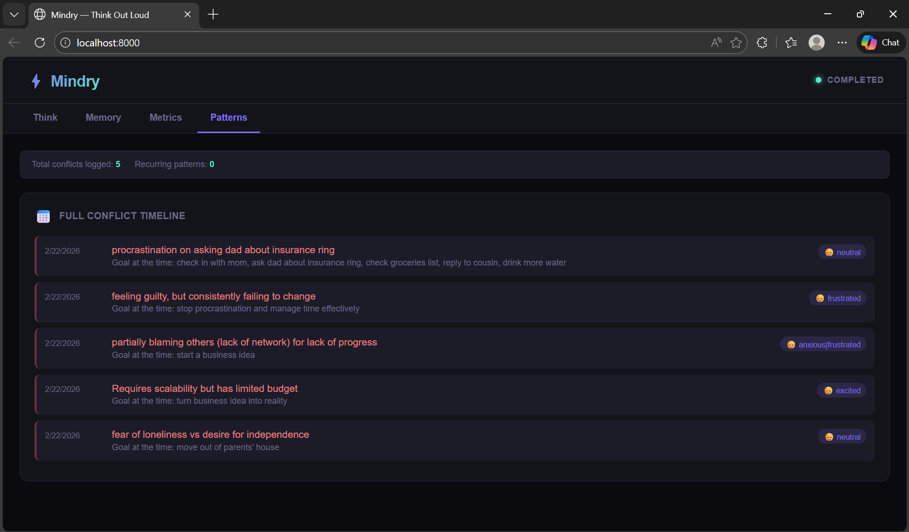

# ⚡ Mindry — Think Out Loud

> **Your brain dumps. Mindry structures them.**
> Voice-first AI that turns messy spoken thoughts into goals, plans, and self-awareness — running 100% on your machine, for free.

---

## 🧠 What Is This?

Most of us don't think in bullet points. We think in circles — rambling, contradicting ourselves, looping back, second-guessing. Mindry accepts that chaos and turns it into something you can actually act on.

Speak freely. Mindry listens, extracts what you *actually* mean, catches where you're contradicting yourself, builds you a plan, and remembers everything — so over time it can show you the patterns in your own thinking that you can't see yourself.

**It is not a journaling app. It is not a chatbot. It is not therapy.**

It's a real-time cognitive execution engine for people who think out loud.

---

## 📸 Product Screenshots

<div align="center">

<table>
<tr>
<td width="50%" align="center">

### 🎯 Thought Analysis  


</td>
<td width="50%" align="center">

### 💾 Memory  


</td>
</tr>

<tr>
<td width="50%" align="center">

### ⚠️ Conflict Detection  


</td>
<td width="50%" align="center">

### 📅 Patterns  


</td>
</tr>

</table>

</div>

---

## ✨ Features

| Feature | What it does |
|---|---|
| 🎤 **Voice Input** | Speak naturally — messy, rambling, unfinished thoughts welcome |
| 🧠 **Thought Structuring** | Extracts your real goal, constraints, emotional state |
| ⚠️ **Conflict Detection** | Finds contradictions *within* a single thought |
| 🗺️ **Roadmap Generation** | 3–5 concrete, specific action steps |
| 💾 **Session Memory** | Every thought saved and revisitable |
| 📅 **Pattern Tracking** | Spots conflicts that keep recurring across weeks |
| 🔊 **Voice Responses** | Reads your structured plan back to you |
| 🔒 **100% Local** | Your data never leaves your machine |
| 💸 **Zero Cost** | Runs on Ollama — no API keys, no subscriptions |

---

## 🏗 How It Works

```
Your voice
    ↓
Web Speech API (browser STT)
    ↓
Agent Runtime
    ├── State Machine       IDLE → EXTRACTING → STRUCTURING → VERIFYING → COMPLETED
    ├── Thought Structurer  raw speech → goal / constraints / emotional state / confidence
    ├── Conflict Detector   finds contradictions in your own thinking
    ├── Roadmap Generator   structured intent → 3-5 action steps
    └── Memory Store        persists everything to mindry_memory.json
    ↓
Structured output + voice response
    ↓
Patterns tab: longitudinal conflict tracking across all sessions
```

The LLM (llama3 via Ollama) only handles meaning — all control flow, state transitions, verification, and guardrails are deterministic code. This means it's reliable, fast to debug, and doesn't hallucinate its way through your life decisions.

---

## 🚀 Setup (Windows)

### Prerequisites
- Python 3.11+ → [python.org](https://python.org/downloads) *(check "Add to PATH")*
- Ollama → [ollama.com/download](https://ollama.com/download/windows)

### Install

```bash
# 1. Pull the AI model (one time, ~4GB)
ollama pull llama3

# 2. Set up Mindry
cd mindry
python -m venv venv
venv\Scripts\activate
pip install -r requirements.txt
copy .env.example .env

# 3. Run
uvicorn main:app --reload --port 8000
```

Open **http://localhost:8000** — done.

> Ollama runs automatically in the background after install. No need to start it manually.

---

## 🎮 Usage

1. Click **🎤** and speak your thought — raw, messy, unfiltered
2. Click **⏹** to stop — Mindry auto-submits
3. See your **goal extracted**, **conflicts flagged**, **roadmap built**
4. Check **Memory** tab to revisit any past session
5. Check **Patterns** tab after a few sessions to see recurring themes in your thinking

**Keyboard shortcut:** `Ctrl+Enter` to submit typed thoughts

---

## 📁 Project Structure

```
mindry/
├── main.py                  # Entry point
├── api/server.py            # FastAPI + WebSocket
├── core/
│   ├── state_machine.py     # 8-state deterministic FSM
│   ├── orchestrator.py      # Plan → Act → Verify → Recover loop
│   └── schemas.py           # Pydantic data models
├── tools/
│   ├── ollama_client.py     # Local LLM client (auto-detects model)
│   ├── structurer.py        # Raw speech → structured JSON
│   ├── contradiction.py     # Conflict detection
│   └── roadmap.py           # Action plan generation
├── memory/
│   └── store.py             # File-backed persistent storage
├── guardrails/
│   └── policy.py            # Input safety rules
└── static/
    └── index.html           # Full UI (single file)
```

---

## 🔧 Configuration

All config lives in `.env`:

```env
LLM_MODEL=llama3            # any ollama model you have pulled
CONFIDENCE_THRESHOLD=0.5    # minimum confidence to save a thought
OLLAMA_BASE_URL=http://localhost:11434
```

**Swap models anytime:**
```bash
ollama pull mistral    # faster
ollama pull llama3.1   # more capable
```
Then update `LLM_MODEL` in `.env`.

---

## 🧱 Tech Stack

| Layer | Tech |
|---|---|
| Backend | FastAPI + Uvicorn + asyncio |
| LLM | Ollama (llama3) — local, free |
| Voice In | Web Speech API (Chrome/Edge) |
| Voice Out | Web Speech Synthesis API |
| Storage | JSON file (mindry_memory.json) |
| Realtime | WebSocket |
| Validation | Pydantic v2 |

---

## 🗺 Roadmap

- [ ] Faster-Whisper for better voice recognition on long rambling thoughts
- [ ] Weekly pattern digest — "this week your main conflict was X"
- [ ] Cross-session goal evolution tracking — "3 weeks ago you said X, now you say Y"
- [ ] Export to markdown / PDF
- [ ] Mobile PWA support

---

## 🤔 Why Not Just Use ChatGPT?

You could. But:

- ChatGPT doesn't run locally — your most personal thoughts go to a server
- ChatGPT has no memory across sessions unless you pay
- ChatGPT doesn't track your conflict patterns over time
- ChatGPT is a chatbot — Mindry is a structured execution runtime with deterministic state management

---

## 📄 License

MIT — do whatever you want with it.

---

<div align="center">
  <strong>Built for people who think better out loud than on paper.</strong>
</div>
